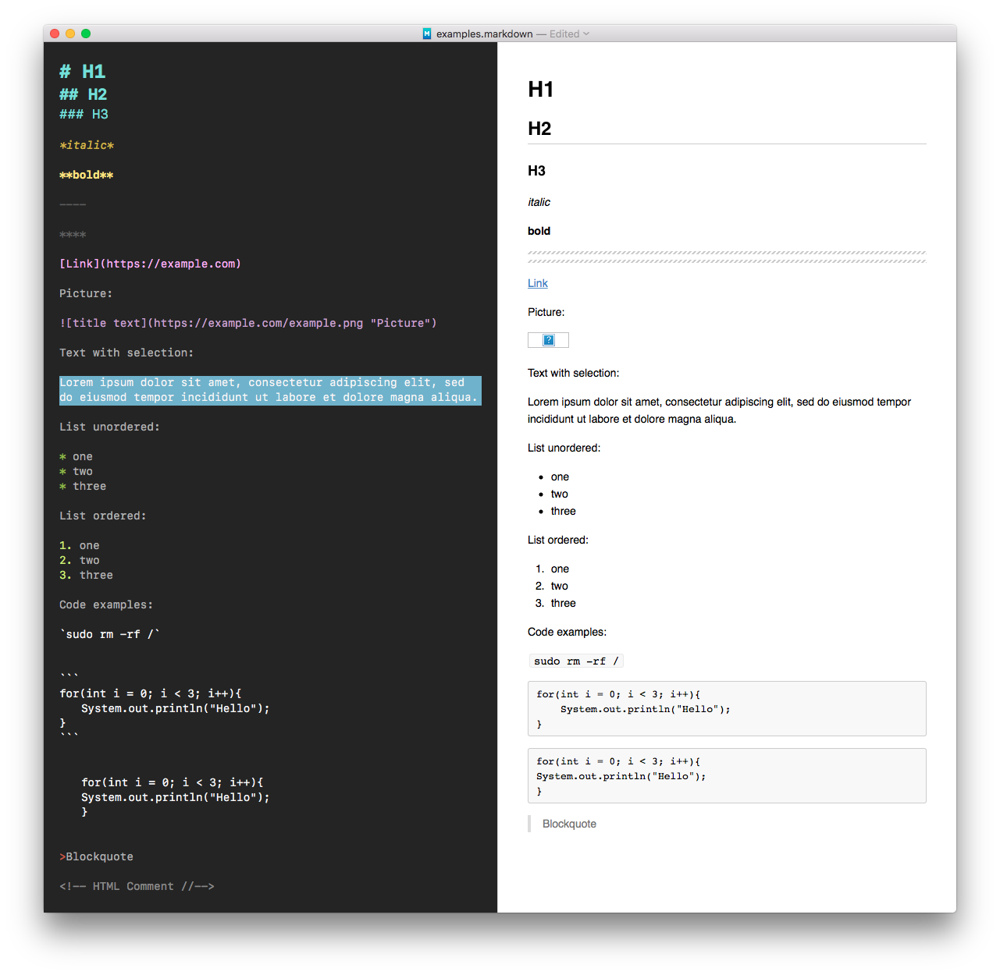

# SMYCK color theme for MacDown Markdown editor

A color theme for the [MacDown Markdown editor](https://macdown.uranusjr.com) based on the [SMYCK color theme](http://color.smyck.org).

## Installation:

Clone the theme-files to a local directory:

	git clone https://github.com/deg0nz/macdown-smyck-theme.git
	
Copy the SMYCK.txt to `~/Library/Application Support/MacDown/Themes/`:

	cp ./SMYCK.style ~/Library/Application\ Support/MacDown/Themes/
	
Choose the theme the MacDown preferences. Reload, if necessary.   
Done.
	
## Screenshot:

## Comments

Originally, this was a theme for the Mou Markdown editor. [But since this project is dead](https://www.indiegogo.com/projects/mou-1-0-markdown-editor-on-os-x-for-you#/comments) for some time now, I switched to MacDown some time ago. Fortunately, MacDown supports the identical Mou color theme syntax, so I didn't really have to change anything here...